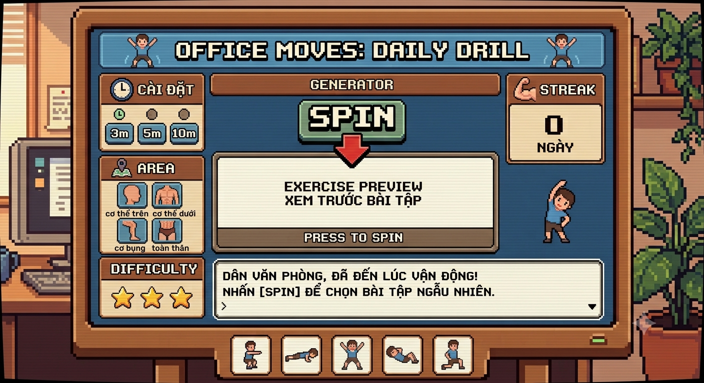

# OFFICE MOVES: DAILY DRILL

Máy quay bài tập ngẫu nhiên cho dân văn phòng, dựng theo phong cách pixel-art 8-bit.
Chọn bộ lọc, nhấn **SPIN**, nhận một bài tập tại chỗ kèm đồng hồ đếm ngược — và giữ streak mỗi ngày.



## Chạy dự án

```bash
npm install
npm run dev      # http://localhost:5173
npm run build    # bản production vào dist/
npm run lint
```

## Tech stack

| Thành phần | Lựa chọn |
| --- | --- |
| Framework | React 19 + Vite 8 + TypeScript |
| Styling | Tailwind CSS v4 (plugin `@tailwindcss/vite`) + CSS pixel-art thủ công |
| Font | `Press Start 2P` (tiêu đề ASCII), `Handjet` (chữ Việt), `VT323` (nội dung) |
| Âm thanh | Web Audio API — tổng hợp trực tiếp, không cần file audio |
| Hiệu ứng | `canvas-confetti` khi hoàn thành bài tập / tăng streak |

## Cấu trúc

```
src/
  App.tsx                 Bố cục 3 cột, state tổng, phím tắt [SPACE]
  types.ts                Kiểu dữ liệu dùng chung
  data/exercises.json     28 bài tập văn phòng (tiếng Việt)
  lib/
    exercises.ts          Lọc, chọn ngẫu nhiên, ánh xạ sprite, thời lượng gợi ý
    audio.ts              Hiệu ứng âm thanh chiptune (Web Audio API)
    storage.ts            Bọc localStorage an toàn + tiện ích ngày
  hooks/
    useSpin.ts            Vòng quay gacha với nhịp ease-out
    useTimer.ts           Đếm ngược theo deadline (đúng cả khi tab chạy nền)
    useStreak.ts          Streak theo ngày, tự reset khi bỏ lỡ
    useSession.ts         Tiến độ buổi tập, cộng dồn theo giây đã tập xong
  components/
    Banner.tsx            Tiêu đề + công tắc âm thanh
    FilterPanel.tsx       THỜI GIAN / KHU VỰC / ĐỘ KHÓ
    Generator.tsx         Nút SPIN, màn hình quay, khung kết quả
    ExerciseCard.tsx      Chi tiết bài tập + chọn khối lượng
    Timer.tsx             Đồng hồ đếm ngược + điều khiển
    StreakPanel.tsx       Bộ đếm streak, mascot, nút đánh dấu
    Terminal.tsx          Hộp thoại kiểu RPG (gõ từng ký tự)
    ExerciseDock.tsx      Dãy icon bài tập dưới cùng
    Pixel.tsx             Sprite / Section / Stars dùng chung
```

## Tài nguyên pixel art

Sprite gốc nằm ở `assets-src/`, chia làm nhiều đợt:

**Đợt 1 — `area-sheet`, `character-asset`, `exercise-icon-row`, `spin-button-asset`,
`star-sheet`** (1408×768, canvas gốc **120×65**). Nền ca-rô bị *vẽ chết* vào ảnh
chứ không phải alpha thật, nên phải tách bằng chroma/độ sáng. Riêng nút SPIN phải
flood fill từ viền vì chữ kem trùng đúng màu ô ca-rô sáng.

**Đợt 2 — `main-model.png`** (1408×768, canvas gốc **240×131** — gấp đôi đợt 1).
Nền magenta đặc `#FF00FF` nên tách một bước là sạch. Sheet này có kèm chữ nhãn
(`SQUAT`, `PUSH-UP`, …) nên khi gán nhãn thành phần liên thông phải lọc thêm:
component nào không chứa pixel *tươi* (lum > 85 và chroma > 28) thì đó là chữ,
bỏ đi. Cách này tách đúng 14/14 sprite, không lọt nhãn nào.

Sau khi cắt, mọi sprite đều đi qua bước **lượng tử hoá bảng màu** (k-means,
k-means++ seeding, seed cố định). Ảnh nguồn là render mềm có khử răng cưa nên mỗi
pixel một màu khác nhau — phóng to lên là lấm tấm. Quantize kéo từ 200–540 màu
xuống 10–14 màu, tức 0.01–0.04 màu/pixel, đúng mức của pixel art thật.

Viền đen được ghim riêng thành một màu mực. Điều kiện phải là *vừa tối vừa xám*
(`lum < 22` **và** `chroma < 20`): chỉ lọc theo độ tối sẽ nuốt luôn tóc nâu sẫm
(chroma 30–50) và làm mọi nhân vật hói đen.

**Đợt 3 — `main-model-anim.png`** (1408×768, canvas gốc **480×262**). Sheet có
lưới ô và 4 hàng, nhưng chỉ **hàng 1 + hàng 2 mới cùng tỉ lệ và đủ 7 cột** — hàng
3 thiếu 4 cột, hàng 4 vẽ to hơn hẳn. Chỉ hàng 1–2 được dùng làm cặp khung hoạt
hình. Nền ở sheet này là hồng nhạt `#FF66FC` kèm đường kẻ lưới, và điều kiện tách
phải nới xuống `R>110 && B>110` mới ăn hết viền tím nhạt (`#9F509D`) sinh ra ở
chỗ nền hoà vào nét đen — nếu chỉ lọc `R>175` thì 39 pixel tím lọt vào bảng màu.

Hai khung của cùng một bài được **quantize chung một lần** để chia sẻ đúng một
bảng màu; nếu quantize riêng, nhân vật sẽ đổi sắc mỗi lần đảo khung. Khung cũng
được căn theo **tâm ngang + mép đáy** trên một canvas chung nên bàn chân không
nhảy khi hoạt hình.

**Đợt 4 — `main-model-idle.png`** (1376×768, canvas gốc **240×134**). Cấp khung
idle cho mascot, nhân vật banner và một biến thể nút SPIN. Gemini vẽ **hai tư thế
nghiêng cùng một bên** thay vì hai bên đối nhau, nên khung nghiêng còn lại được
tạo bằng cách **lật ngang** — thao tác không mất mát với pixel art vì chỉ đảo thứ
tự cột, không resample.

Một lỗi chỉ lộ ra ở đợt này: bộ lọc nền cũ đòi `R>110` nên bỏ sót màu tím sẫm
`#520150` sinh ra ở rìa nơi nền hoà vào nét đen. k-means gom chúng thành hẳn một
cụm tím trong bảng màu. Quy tắc mới `G < min(R,B) − 25` bắt được, và mỗi pixel
tím được thay bằng màu láng giềng chiếm đa số (hoặc xoá nếu quanh nó chủ yếu là
nền). Đã quét lại toàn bộ và sửa **333 pixel trên 16 file**, kể cả các sprite cắt
từ những đợt trước.

**Đợt 5 — `ex-upper/lower/core/full/stretch.png`** (mỗi ảnh 1408×768; native
240×131, riêng `ex-core` 480×262). Cấp cho **mỗi bài tập một bộ ảnh riêng**.

Trước đó 28 bài dùng chung 7 icon, và chỉ **6/28** khớp đúng động tác: plank
nghiêng hông hiện hình hít đất, cả 5 bài giãn cơ hiện cùng một hình nghiêng
người, cầu mông hiện hình gập bụng. Năm sheet này xoá hẳn vấn đề đó.

Mỗi sheet một kiểu bố cục nên bộ cắt nhận một **bảng chọn khung tường minh**
(`PLAN` trong quy trình) thay vì đoán: `ex-upper` 3 hàng, `ex-core` 4 hàng,
`ex-lower` có chữ nhãn và vài ô vẽ 2 nhân vật. Một trường hợp phải cắt tay:
khung 2 của *Squat ghế* có thêm một người đứng dính vào qua vạch sàn 1px — cắt
theo khe hở ở cột 27, và hai khung dùng **chung cửa sổ trục X** để cái ghế không
xê dịch giữa hai khung.

**Đợt 6 — 8 ảnh sửa tư thế** (`wall-pushup`, `seated-knee-tuck`, `wall-sit`,
`standing-hamstring`, `dead-bug`, `mountain-climber`, `neck-shoulder-stretch`,
`wrist-forearm-stretch`). Một lần rà soát cho thấy các sprite này vẽ **sai động
tác**, không chỉ sai kỹ thuật: khung 2 của hít đất tường vẽ thân gần như nằm
ngang (thành hít đất sàn), gập gối trên ghế vẽ hai tay ôm ống chân trong khi mô
tả yêu cầu bám mép ghế, tựa tường giữ đùi chưa hạ tới mức đùi song song sàn,
giãn gân kheo đứng vẽ gối gập trong khi mô tả yêu cầu chân thẳng, và giãn cổ tay
thì không có nhân vật — chỉ là mấy cánh tay rời với bàn tay vỡ hình.

Ba quy tắc bắt buộc khi ghép một cặp khung. Vi phạm cái nào cũng làm nhân vật
hoặc bối cảnh giật mỗi lần đảo khung:

1. **Cắt hai khung bằng cùng một khung cắt** — lấy hợp của bbox hai khung, không
   bao giờ trim riêng từng khung. Trim riêng chính là nguyên nhân gốc của lỗi giật.
2. **Căn lề theo mặt trong của đạo cụ mà nhân vật tựa vào.** Gemini vẽ bức tường
   lệch 24px giữa hai khung ở `wall-pushup` và 35px ở `wall-sit`; căn theo tường
   thì nhân vật mới đứng đúng chỗ.
3. **Hàng dưới cùng — đường sàn — phải giống hệt nhau ở cả hai khung**, màu
   `#1A1412`, kéo hết chiều ngang. Trước đó đường sàn được vẽ rộng bằng nhân vật
   nên nó phình/co mỗi 520ms; nặng nhất là `calf-raise` (6% → 100% bề ngang).
   Đã chuẩn hoá cho **cả 28 bài**, không riêng 8 bài vẽ lại.

**Đợt 7 — `background-attachment.png`** (2752×1536 → `bg-office.png` 480×268, 48
màu, 14.7 KB). Tranh nền phòng làm việc thay cho gradient nâu cũ, vốn trùng tông
với khung gỗ tủ arcade nên làm tủ chìm vào nền.

Bố cục phải **để trống phần giữa**: tủ arcade (`max-w-[1180px]`) che 62% bề ngang
trên desktop, còn trên mobile `background-size: cover` cắt chỉ còn ~26% ở chính
giữa. Mọi đồ đạc vì thế dồn về hai rìa trái/phải.

Ở đợt này `Image.quantize` median-cut **không dùng được**: nó chia bảng màu theo
thể tích nên mảng tường lớn nuốt mất chậu cây xanh và ánh đèn vàng — hỏng ở cả
24/32/48/96 màu. Thay bằng **k-means chạy trên tập màu duy nhất với trọng số
`sqrt(count)`** thay vì `count`; căn bậc hai làm phẳng chênh lệch nên màu hiếm
vẫn giành được một ô trong bảng màu. (libimagequant không được biên dịch sẵn
trong Pillow, và máy không có `pngquant`.)

Một thói quen của Gemini cần nhớ cho các đợt sau: nó hay chèn thêm một **vệt lấp
lánh ✦** màu sáng vào góc dưới phải ảnh. Vệt này xuất hiện ở hầu hết ảnh đợt 6 và
cả ảnh nền. Cách xử lý: lọc bỏ các thành phần liên thông nhỏ và rời rạc (với
sprite), hoặc vá lại theo median từng hàng để giữ đúng dải chuyển sắc dọc (với
ảnh nền).

Kết quả trong `public/assets/`:

- `sprites/` — 70 sprite riêng lẻ: **28 bài tập × 2 khung**, mascot × 3 khung,
  nhân vật banner × 2 khung, 5 icon khu vực, nút SPIN, mũi tên, 2 sao
- `area-sheet.png`, `star-sheet.png`, `spin-button.png`, `exercise-icon-row.png`,
  `character-asset.png` — bản tách nền của các sheet đợt 1 (giữ để tham chiếu)
- `bg-office.png` — tranh nền phòng làm việc 480×268, gắn vào `body` bằng
  `background-size: cover` + `image-rendering: pixelated`
- `ui-mockup.png` — ảnh giao diện tham chiếu

Mọi ảnh đều render với `image-rendering: pixelated` và scale bằng bội số nguyên.

## Tính năng

- **Bộ lọc** — thời lượng buổi tập (3/5/10 phút), khu vực cơ thể (chọn nhiều, bỏ
  trống = tất cả), trần độ khó theo sao. Số bài khớp hiển thị trực tiếp. Nút "?"
  ở ĐỘ KHÓ giải thích rằng sao là mức **tối đa** chứ không phải mức chính xác —
  chọn 2 sao là lấy cả bài 1 sao lẫn 2 sao.
- **Buổi tập thật sự dài đúng số phút đã chọn** — một lần quay vẫn là một bài,
  nhưng app cộng dồn số giây đã tập xong và hiện thanh tiến độ *"BUỔI 5 PHÚT ·
  3 BÀI XONG · Còn 02:30"*. Chỉ đồng hồ chạy hết mới được tính. Đổi thời lượng
  giữa chừng thì phần đã tập được giữ nguyên, chỉ dời đích.
- **Vòng quay** — người thắng được chọn trước, reel cuộn qua pool với nhịp chậm
  dần (cubic ease-out) kèm tiếng tick tăng dần cao độ.
- **Thẻ bài tập** — icon **hoạt hình 2 khung** minh hoạ động tác, hướng dẫn từng
  bước, mẹo cho dân văn phòng, chọn khối lượng (giây hoặc số lần) với gợi ý theo
  thời lượng buổi tập. Bài tập hai bên (`perSide`) hiển thị "/BÊN". Nút "?" cạnh
  nhãn KHỐI LƯỢNG giải thích con số nghĩa là gì và vì sao mức gợi ý đổi theo
  thời lượng buổi tập. Lời giải thích đổi theo từng bài: bài tính bằng *số lần*,
  bài *giữ yên* một tư thế (plank, giãn cơ) và bài *lặp động tác liên tục*
  (nhảy dang tay chân, chạy nâng cao gối) có cách diễn đạt riêng — phân biệt qua
  trường `timedAs` trong dữ liệu.
- **Đồng hồ** — đếm ngược theo mốc thời gian thực nên vẫn chính xác khi tab chạy
  nền; beep 3 giây cuối, chime + confetti khi xong.
- **Đồng hồ 2 chặng cho bài tập hai bên** — 6 bài (`perSide`) tự chạy bên 1 →
  chuông đổi bên → nghỉ 4 giây → bên 2, chỉ cần bấm [BẮT ĐẦU] một lần. Mỗi chặng
  được cộng vào buổi tập ngay khi xong, nhưng cả hai chặng chỉ tính là **một
  bài** — bỏ dở giữa chừng thì vẫn được ghi nhận phần đã làm.
- **Streak** — lưu `localStorage`, nối tiếp nếu tập hôm qua, reset nếu bỏ lỡ.
- **Âm thanh** — toàn bộ SFX tổng hợp bằng oscillator, bật/tắt bằng nút `SFX`.
- **Bàn phím** — `[SPACE]` để quay.
- **Responsive** — 3 cột trên desktop, xếp dọc trên mobile (generator lên đầu).
- **Ảnh riêng cho từng bài** — cả 28 bài đều có bộ ảnh của riêng mình, tra theo
  `id`; không còn bài nào dùng nhờ hình của bài khác.
- **Hoạt hình nhiều khung** — bài tập 2 khung, mascot 3 khung (thẳng → nghiêng
  trái → thẳng → nghiêng phải), nhân vật banner 2 khung. Mọi khung của cùng một
  nhân vật dùng **chung một bảng màu** (quantize gộp) để không đổi sắc khi đảo
  khung, và căn theo tâm ngang + mép đáy nên bàn chân không nhảy.
- **Giảm chuyển động** — tôn trọng `prefers-reduced-motion`.

### Dữ liệu lưu trên máy

`localStorage` dưới tiền tố `office-moves:` — `streak`, `filters`, `muted`.
Không có backend, không gửi dữ liệu đi đâu.

## Ghi chú kỹ thuật

**Vì sao có hai font pixel?** `Press Start 2P` không có glyph tiếng Việt — dấu bị
rơi sang font fallback và chồng lệch. Trong các font pixel trên Google Fonts, chỉ
`VT323` và `Handjet` có subset `vietnamese`. Vì vậy `Press Start 2P` chỉ dùng cho
chuỗi thuần ASCII (tiêu đề, `GENERATOR`, `PRESS TO SPIN`, chữ số đồng hồ), còn
`Handjet` lo phần chữ Việt in hoa và `VT323` lo phần nội dung.

**Vì sao không xoay sprite bằng CSS?** Mascot từng được làm cho "động" bằng
`rotate(±3deg)`. Xoay ảnh pixel art đặt nó lên một lưới nghiêng: `image-rendering:
pixelated` giữ cho ảnh không nhoè, nhưng viền trở nên răng cưa không đều — chỗ
2px chỗ 3px. Nay mọi chuyển động đều là khung vẽ thật, và sprite được hiển thị ở
**bội số nguyên** (mascot 2×, nhân vật banner 1×) để lưới pixel luôn đều.

**InfoTip mở thế nào?** Hover hoặc focus bàn phím là hiện ngay; click thì *ghim*
lại để đọc kỹ (rời chuột không đóng), bấm ra ngoài hoặc `Esc` mới đóng. Cách này
phục vụ cả chuột, bàn phím lẫn cảm ứng — màn cảm ứng không có hover nên vẫn cần
đường click. Panel tự đo chỗ trống rồi chọn mở lên hay xuống, và trượt ngang khi
sắp chạm mép, nên không bao giờ bị cắt hay bắt người dùng cuộn tới. Phần đệm dọc
của panel kiêm luôn "cầu" cho con trỏ đi từ nút xuống panel mà không hụt.

**Vì sao InfoTip tự đặt transform bằng JS?** Tailwind v4 ghi thuộc tính CSS
`translate` riêng chứ không gộp vào `transform`. Dùng class `-translate-x-1/2`
rồi lại ghi `transform` từ JS thì **hai giá trị cộng dồn**, đẩy popover lệch gấp
đôi (đo được: lệch 150px ra ngoài khung máy). Nay việc căn giữa và nắn vào mép
màn hình do một chỗ duy nhất phụ trách.

**Vì sao đồng hồ lưu deadline, và vì sao dùng `setInterval` chứ không phải
`requestAnimationFrame`?** Trình duyệt throttle timer ở tab nền. Đếm ngược bằng
cách trừ dần sẽ chạy chậm lại; lưu mốc kết thúc rồi tính hiệu số với `Date.now()`
cho kết quả đúng bất kể bị throttle. Còn rAF thì bị **dừng hẳn** ở tab ẩn (đo
được: 0 khung hình trong 1,5 giây) — nghĩa là người dùng bật đồng hồ rồi chuyển
tab sẽ không bao giờ chạy hết bài, và buổi tập không được cộng. `setInterval` vẫn
nổ dù bị throttle nên tránh được điều đó.
